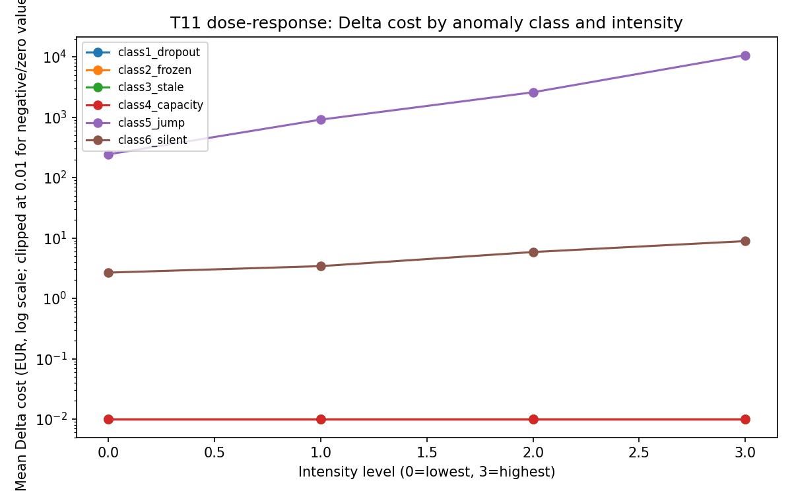

# 5. Results, Discussion, and Conclusion

All figures come from the corrected run of the frozen pipeline under the mid cost profile.
Brackets give 95% percentile-bootstrap intervals over the five seeds of each
cell. Δcost is the cost of a corrupted run minus the cost of the clean run on
the same rows.

## 5.1 Baseline and exposure

On clean data the frozen policy (τ = 0.85) makes 1,313 dispatches over the 12
test periods (360,541 labelled rows, 48.2 hours), a transit cost of €19,695.
Every corrupted dataset is scored on the same evaluation rows against this baseline; rows a fault removes count as "no dispatch".

Before comparing classes, it matters how much data each one touches.
Table 5.1 counts the rows of the test window (887,126, including the
unlabelled rows that feed the lags) that each injection removes or changes.

| Class | Lowest intensity (i0) | Highest intensity (i3) |
|---|---|---|
| 1 Dropout | 4–5 rows removed | 283–290 rows removed |
| 2 Frozen | 0 rows changed | 2–41 rows changed |
| 3 Stale | 0–61 rows changed, up to 4 left empty | 8,120–12,726 rows changed, up to 217 left empty |
| 4 Capacity inconsistency | 49–318 rows changed | 49–318 rows changed |
| 5 Jump | 42,045–42,580 rows changed (4.7–4.8%) | same rows |
| 6 Silent | 39,894–42,149 rows at 16 stations (true value only) | same rows and stations |

*Table 5.1. Test-window rows removed or changed per class, range over five
seeds. Empty rows are scored as "no
dispatch" (§4.3).*

The doses are very unequal: Classes 5 and 6 touch about one row in twenty,
Classes 1, 2, and 4 a few hundred rows at most, and Class 3 about 1% at its
highest intensity, so classes are compared as realistic fault profiles, not
equal doses. A frozen counter often changes nothing, because a station that
did not move during the freeze reports the same values either way.

## 5.2 Occurrence of anomalies (H1)

For SO1, the certification (§3.5) found 72,891 implausible jumps, 1.5% of the
substrate. The frozen-counter flag, raised on a third of observations,
measures how often stations are still for an hour rather than how often
counters are stuck, so it is not an anomaly rate. H1's test therefore uses
jumps, the one class whose detected count reads as a count of faults; station
dropouts and feed-level staleness could be counted from the acquisition
metadata (§3.3) but were not.

Detected jumps are unevenly distributed across stations (LR = 8,223,
df = 319), hours (LR = 3,312, df = 23), and days (LR = 185, df = 38), all
significant after the Holm correction (adjusted p < 10⁻²⁰). The dispersion
parameter (α = 0.13) confirms the overdispersion that motivated the
negative-binomial model. Jumps peak at 18:00 local time (27.7 per 1,000
observations). H1 is supported for jumps. Because the collector lost power
overnight, hours 05:00–09:00 each hold under 1% of observations, so the hourly
pattern is informative only from about 10:00 to 04:00.

## 5.3 Propagation from data to cost (H2)

| Class | i0 | i1 | i2 | i3 |
|---|---|---|---|---|
| 1 Dropout | 0 | 0 | 3 [0; 9] | 0 |
| 2 Frozen | 0 | 0 | 0 | 0 |
| 3 Stale | 0 | 0 | 0 | 0 |
| 4 Capacity inconsistency | 0 | 0 | 0 | 0 |
| 5 Jump | 1,092 [951; 1,233] | 2,238 [2,058; 2,427] | 3,759 [3,585; 3,933] | 6,033 [5,772; 6,234] |
| 6 Silent | 4.1 [3.4; 4.8] | 11.2 [8.9; 12.9] | 23.4 [18.4; 28.5] | 42.3 [33.6; 51.0] |

*Table 5.2. Mean Δcost (€) over the 48.2-hour test window, mid profile, five
seeds per cell. A bare 0 is zero in all five seeds.*

The class × intensity interaction is strong (F(15, 96) = 373.1). The residuals
fail the normality and equal-variance checks (Shapiro–Wilk and Levene,
p < 0.001), so the planned Freedman–Lane test decides: no permutation out of
5,000 reached the observed statistic (p < 1/5,000, still significant after Holm). With many zero-variance cells this test is on weak ground, but Table 5.2
makes the point without it: the Class 5 intervals exclude zero and do not
overlap. The test establishes the class dependence in H2; non-linearity is read
from the dose-response. For Class 5 a tenfold rise in magnitude raises Δcost
5.5-fold, less than proportionally; for Class 6 an eightfold rise in offset
raises it about tenfold, roughly proportionally. The decision-flip rate, the share of labelled rows whose dispatch decision changes, is zero for Classes 2, 3, 4, and 6, 0.002% in one Class 1 cell, and rises from 0.03% to 0.15% for Class 5. H2 is therefore partially supported: the interaction test supports class dependence in Δcost, the flip rate differs by class descriptively, and non-linearity holds only for Class 5.

Jumps cost money through false alarms. For Classes 1–5, Δcost equals €15 per
extra dispatch to within €0.38, so the extra dispatches prevent almost no
unserved hours. A jump pushes lagged readings towards empty or full, the
probability crosses τ, and a van is sent needlessly: dispatches rise to 1,386,
1,462, 1,564, and 1,715 across intensities (31% above baseline at i3), as the
mean number of changed decisions grows from 106 to 523.

Silent misreporting works through the penalty instead. The feed is unchanged,
so no decision changes, but at the 16 affected stations fewer bikes are usable
than reported, and some rows shown as safe are in fact critical and unserved.
The amounts are small, and no detector here can see them.

The other four classes cost almost nothing for two reasons. They touch little
data (Table 5.1), and the frozen model responds weakly to changes in station
counts: all eight lag coefficients of the frozen model are below 0.08 per bike
or dock, so a
change of a few bikes moves the log-odds by a few tenths at most. A pilot
diagnostic on the earlier model identified the cause. The critical state is
two-sided, near empty *or* near full, which counts entered linearly cannot
capture: the combined target reached an AUC of 0.66, while "near empty" and
"near full" predicted separately each reached about 0.97. The finding was recorded and not
acted on, since changing the model after seeing which classes matter is the
post-hoc tuning the freeze prevents. Against this model, only jumps, which move
a count by up to 20 bikes at one row in twenty, often cross τ = 0.85.

The one non-zero cell among Classes 1–4 is a single Class 1 run at i2: a
dropout removed 107 labelled rows, 44 decisions changed, and episodes rose from
1,313 to 1,314. Removed rows are scored as "no dispatch", so a dropout inside
an ongoing dispatch run splits it in two. That €15, divided over five seeds,
is the €3 mean. More generally, since one €15 dispatch equals about 31 unserved
station-hours at €0.485, a policy that rarely dispatches loses little from
missing or stale data; what it cannot absorb is data that looks alarming but
is wrong.

## 5.4 Recovery by the safeguard (H3)

| Intensity | Δcost before (€) | Δcost after (€) | Recovered (€) [95% CI] | Share |
|---|---|---|---|---|
| i0 | 1,092 | 108 | 984 [858; 1,098] | 90.1% |
| i1 | 2,238 | 102 | 2,136 [1,962; 2,331] | 95.4% |
| i2 | 3,759 | 165 | 3,594 [3,426; 3,798] | 95.6% |
| i3 | 6,033 | 201 | 5,832 [5,616; 6,030] | 96.7% |

*Table 5.3. Class 5 recovery by the safeguard (share = recovered ÷ Δcost
before).*

Every interval excludes zero, and the pooled Wilcoxon test (n = 20) gives
p = 1.9 × 10⁻⁶. H3 set no numerical threshold for "substantial", so the
verdict rests on the size of the effect: at 90–97% throughout, H3 is supported
for Class 5.

Class 2 is the counter-case. There the safeguard lowers cost by €15.05 below
the clean run in all 20 runs, identically at every intensity. A change that
ignores the size of the fault cannot come from the fault: the 3-minute
detector also flags readings that are simply unchanged, common in this system
(§3.5), and carrying them forward removes one dispatch the clean policy makes.
This is not recovery, since Class 2 caused no Δcost, and its significant
Wilcoxon result (p = 7.7 × 10⁻⁶) reflects the same shift: a low-precision
detector alters decisions where nothing was wrong. Class 4 cannot be assessed
(§4.4), and Class 6 is the unrecoverable floor. H3 rests on Class 5.

## 5.5 The quality-aware assistant (H4)

| Model | Warns, blind (%) | Warns, aware (%) | Abstains correctly, aware (%) | Agrees with clean-model action, aware (%) | Stable (%) |
|---|---|---|---|---|---|
| gpt-oss-20b | 4 | 100 | 58 | 50 | 88 |
| gpt-oss-120b | 12 | 100 | 71 | 50 | 85 |
| Qwen3.8-27B | 88 | 100 | 75 | 38 | 100 |

*Table 5.4. Corrupted-and-flagged scenarios, means over 8 scenarios × 3
repetitions (metrics as in §4.6; blind prompts carry no flags; stability over
all 48 cells).*

Flags change what the assistants say. Without them the gpt-oss models rarely
warned (4% and 12%); with them all three warned every time, and Qwen already
spotted most jumps from the numbers alone (88%). On clean data the gpt-oss
models raised no false alarms, while Qwen warned or abstained in 12–25% of
answers, a defensible caution given a forecaster with an AUC of 0.58.

Flags change what they decide much less. Without flags the gpt-oss models
never abstained, scoring 50% on abstention correctness (right only where the
corruption did not matter); with flags they reached 58% and 71%, and Qwen
stayed at 75%. Even flagged, the models abstained in only 8%, 21%, and 50% of
answers; mostly they noted the problem and followed the recommendation. The agreement column points the same way: 50% is what repeating the recommendation yields, and Qwen's 38% reflects abstentions, which never count as agreement. H4 is
supported descriptively, strongly for warnings and weakly for abstention.

The *corrupted* condition, meant to simulate a failed detector, did not work
as designed: given the jump rule, gpt-oss-120b warned in 96% of answers and
Qwen in all, applying the rule themselves; only gpt-oss-20b (38%) behaved like
a failed detector. Finally, 47 of 432 answers fail the groundedness check; on
inspection these are derived numbers ("a jump of 10 bikes"), not invented ones,
and the metric is reported as registered.

## 5.6 Discussion

How far degradation travels in this pipeline depends on what a fault does to
the decision rule, not on how large it looks in the data. Missing, frozen,
stale, and capacity faults did not reach cost, because they touched little
data and the model responds weakly to count changes, so a conservative
threshold rarely acts on them. The expensive fault is the one that looks like
signal: a jump reads as a station emptying or filling, and the operator pays
for a van. This fits the data-cascade argument of Sambasivan et al. (2021) and
sharpens the point of Gammelli et al. (2022) that forecast and decision quality
can diverge: the same input error is harmless or costly depending on whether it
can push a prediction across the threshold.

A few lines of rule-based validation, without retraining, recovered 90–97% of
the jump loss, so the declarative checks of Breck et al. (2019) and Schelter et
al. (2018) pay off here in euros. The bounds are that this detector also
defined the clean substrate, that a noisy detector (Class 2) can change sound
decisions, and that no validation sees a fault leaving no trace in the feed
(Class 6). The assistant experiment fits the same picture: flags made the
models say the right thing about data quality, not reliably do the right
thing about the dispatch. The assistant works as an alarm; the rule-based
safeguard is what recovers the cost.

## 5.7 Limitations

First, the null results for Classes 1–4 hold for this model and threshold, not
in general. A model using occupancy relative to capacity, or predicting "near
empty" and "near full" separately, would respond more to counts and could
expose those classes. τ was also calibrated on validation periods that largely
coincide with Milan's August holidays, while testing ran in September. Both follow from the choice to keep the model simple and frozen, so that any change in cost can be attributed to the data (§1.2).

Second, the penalty is an opportunity-cost proxy that assumes a dispatch fully
prevents the shortfall it anticipates, and two parameters (cost per dispatch
and σ) are unsourced. Holding τ fixed, the other values can be read off the
mechanism of §5.3: Class 1–5 figures scale with the cost per dispatch (by
two-thirds at €10, five-thirds at €25) and the ranking holds; Class 6 figures
scale with revenue, pickup rate, and (1 − σ), falling to zero with no revenue
per ride and rising at most about 7.4-fold at the costliest combination,
still below the lowest Class 5 figure at €10. How τ itself would change is not
known.

Third, Class 5 recovery is partly circular, since the same detector certified
the substrate and acts as the safeguard: it shows the detector covers the fault
it was built for, not that such safeguards work in general. The safeguard could
not be assessed for Classes 1, 3, and 4.

Fourth, doses differ by class (Table 5.1), five seeds give intervals that
understate uncertainty, and the H2 permutation test rests on zero-variance
cells; this matters less for the large Class 5 effects than for the small
Class 1 and 6 effects. Fifth, the collection is weighted towards the daytime: 05:00–09:00 are almost unobserved, so hourly findings hold only for about 10:00 to 04:00, and SO1 is answered only for jumps. Finally, the assistant experiment is
descriptive: eight Class 5 scenarios from one dataset, three models from two
families through one provider, a "failed detector" condition the models
circumvented, and a strict groundedness rule.

## 5.8 Conclusion

This thesis asked how data-quality degradation in a live bike-sharing feed
travels from raw data to operational cost, and how much of the harm can be
recovered without improving the model. On 62 certified periods of Milan's
BikeMi feed, with a frozen model and threshold, implausible jumps occur
unevenly across stations, days, and the hours adequately covered (H1). Cost depends strongly on the class of fault (H2, partially supported): jumps cost up to €6,033 over 48 hours by triggering
false-alarm dispatches; silent misreporting costs less but cannot be seen; and
dropouts, frozen counters, stale feeds, and capacity inconsistencies cost nothing or
almost nothing, because they touch little data and the model responds weakly
to the counts they alter. A carry-forward safeguard recovers 90–97% of the
jump loss (H3). Language-model assistants given quality flags warn reliably but
mostly still follow the recommendation (H4).

In this pipeline, the lesson for an operator is to validate first for faults that imitate
demand, since a conservative policy acts on those, and to treat a language
model as an alarm, not a repair. Future work could use a forecaster that
captures the two-sided critical state and a lower threshold, add early-morning
data, count dropouts and staleness from the acquisition metadata, source the
dispatch cost from an operator, test the safeguard on stale and capacity
faults, and extend the assistant test to more classes and scenarios.
